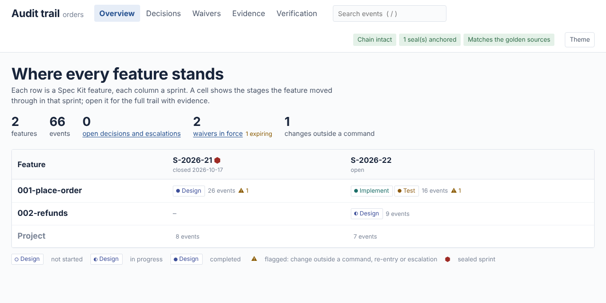
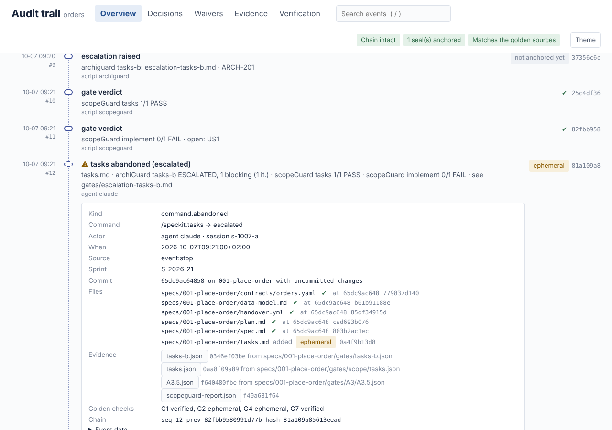

# auditGuard for Spec Kit

[](https://github.com/rlgdev/spec-kit-auditguard/actions/workflows/ci.yml)
[](LICENSE)

> Part of the **Guardians** family for Spec Kit (scopeGuard · archiGuard · auditGuard). Install the three together with the [Guardians bundle](https://github.com/rlgdev/spec-kit-guardians) and start with its [getting-started guide](https://github.com/rlgdev/spec-kit-guardians/blob/main/docs/getting-started.md).

**A tamper-evident audit trail of the [GitHub Spec Kit](https://github.com/github/spec-kit) SDLC, written by a
script, never by the agent - and verifiable against the golden sources.**
auditGuard records every Spec Kit command a feature goes through and marks the stage it belongs to (Design →
Implement → Test). It snapshots the gate reports of [scopeGuard](https://github.com/rlgdev/spec-kit-scopeguard)
and [archiGuard](https://github.com/rlgdev/spec-kit-archiguard) as they were at that moment, keeps the history of
every waiver and deferral, records every human decision, and flags every change no recorded command explains. The
trail lives in `audit/`, partitioned by sprint and feature, as hash-chained JSON Lines with Markdown views and an
offline HTML viewer. A closed sprint is sealed, anchored in git and exportable as an audit pack.

auditGuard is a **recorder, not a gate**: in the default `mode: record` it never blocks a command. `mode: enforce`
turns its completeness rules (no implement before a signed design, no sprint closed with an undecided escalation,
...) into failures of `auditguard check`, `sprint close` and CI.



## Why

An agent-built feature leaves its decisions scattered: a plan that was repaired twice, a scope gate that escalated, a
waiver approved in a ledger, a design signed in a JSON file, a plan edited by hand after the sign-off, a workflow
gate approved on someone's terminal. Spec Kit keeps none of this as a record, and a commit log only shows the end
state. Auditing "who decided what, on which evidence, and did the code that shipped come from the design that was
signed" means reconstructing it by hand.

auditGuard makes the trail data. Every event is one line of JSON chained to the one before it, so an edited,
removed or reordered line breaks the chain. Every claim in it (this file had this content at this commit, this
design was signed with these hashes, this waiver was approved by this person) can be re-derived from git, the BA
handover pins, the standards lock, the decision ledger and the workflow runs - `auditguard verify --golden` does
exactly that and prints the command that reproduces every finding.

## How it works

| What | How auditGuard gets it |
|------|------------------------|
| **Commands** | a mandatory hook on `before_*` and `after_*` of all ten Spec Kit commands (`specify`, `clarify`, `plan`, `tasks`, `analyze`, `checklist`, `constitution`, `converge`, `implement`, `taskstoissues`): `command.started` / `command.finished` with the sha256 of every design artefact, the files the command changed (design and code), the outcome and the actor |
| **Commands that ended early** | the agent's `stop` event: a command whose `after_` hook never ran (an escalation ends it) is closed as `command.abandoned`, with outcome `escalated` |
| **Stages** | each command belongs to a stage (data in the config); `stage.entered`, `stage.completed` (by a milestone: the design sign-off, the implement approval, the PR approval) and `stage.reentered` when work goes back |
| **Gate reports** | collectors read what scopeGuard and archiGuard wrote (step verdicts with their iteration history, scopeGuard's coverage report, escalation notes) and keep content-addressed snapshots as evidence |
| **Waiver history** | scope deferrals (`## Scope Coverage`), architecture deviations (`## Architecture Conformance`) and archiGuard's decision ledger: `waiver.added`, `changed`, `approved`, `revoked`, `expired`, `removed` |
| **Human decisions** | archiGuard sign-off and re-open, Spec Kit workflow gate verdicts, ledger ADR status, and `auditguard decide` (escalation answers, design / implement / PR approval, spec changes) - with the person, role and reason |
| **Changes outside commands** | at every hook the artefact and code hashes are compared with the last record: a hand edit of a signed plan, a command run with hooks skipped, becomes `artefact.changed` with its author |
| **Sessions** | the agent's `session_start` / `session_end` events; every agent event carries the session id |

The agent cannot write the trail: a `pre_tool_use` guard blocks agent edits under `audit/` and the commands
reserved for people (`decide`, `note`, `sprint open|close`, `anchor`). It is a convenience; CODEOWNERS on `audit/`
and `auditguard verify` in CI are the guarantee.

## Install

Requires Spec Kit (`specify-cli`) 1.0.1 or newer, Python 3.9+ (standard library only) and git. If `python` is not
on `PATH`, the launchers use the Python that ships with `specify-cli`, or `uv`.

```bash
# 1. the extension: the recorder, its hooks and agent events, the config file
specify extension add auditguard --from https://github.com/rlgdev/spec-kit-auditguard/releases/download/v0.1.0/auditguard.zip

# 2. apply the config: hooks on, the sprint register, .gitattributes for the hash chain
bash .specify/extensions/auditguard/scripts/bash/auditguard.sh configure
#    Windows: .specify/extensions/auditguard/scripts/powershell/auditguard.ps1 configure
#    or, inside your agent: /speckit.auditguard.configure

# 3. open the first sprint (a person does this; the agent is not allowed to)
bash .specify/extensions/auditguard/scripts/bash/auditguard.sh sprint open S-2026-21 \
     --name "Sprint 21" --start 2026-10-06 --end 2026-10-17 --by "Roman"
```

Spec Kit asks you to confirm installs from a URL; answer `y`. Use `releases/latest/download/...` to always get the
newest release. To upgrade, add `--force` to step 1 and run step 2 again; your `auditguard-config.yml` is kept.

<details>
<summary>Install through a catalog (for teams)</summary>

A project catalog file (`.specify/extension-catalogs.yml`) **replaces** Spec Kit's own catalogs, so add those first;
without them every other extension disappears from `specify extension search`, `info` and `update`. (With a
user-level `~/.specify/extension-catalogs.yml`, add its entries instead.)

```bash
specify extension catalog add https://raw.githubusercontent.com/github/spec-kit/main/extensions/catalog.json            --name default    --priority 1  --install-allowed
specify extension catalog add https://raw.githubusercontent.com/github/spec-kit/main/extensions/catalog.community.json  --name community  --priority 20 --no-install-allowed
specify extension catalog add https://raw.githubusercontent.com/rlgdev/spec-kit-auditguard/main/catalog/extensions.json --name auditguard --priority 10 --install-allowed
specify extension add auditguard
```

`community` comes after the auditGuard catalog: it is discovery-only, and the catalog you trust must win a shared id.

For a corporate catalog, mirror the archive into the internal catalog and pin it by version and sha256
(`dist/SHA256SUMS` is attached to every release).

</details>

Then use Spec Kit as usual. Commit `audit/` with your work. Protect it with CODEOWNERS (the lead architect), and if
archiGuard is installed add `"audit/**"` to its `edit_guard.always_readonly` (`configure` prints the line).

## What the trail looks like

```text
audit/
  sprints.yml                         the sprint register (auditguard sprint open / close)
  index.md                            sprints × features × stages
  verify-report.json                  the last verification (regenerable)
  sprints/S-2026-21/
    seal.json                         written when the sprint was closed
    sprint.md                         everything that happened in the sprint
    _project/journal.jsonl            project events: sprints, sessions, notes, constitution
    001-place-order/journal.jsonl     THE record: one hash-chained JSON event per line
    001-place-order/trail.md          the view, by stage
    001-place-order/evidence/         content-addressed snapshots: <sha256[:12]>-<name>
  features/001-place-order.md         the feature across sprints
  viewer/index.html, data.js          the offline viewer
```

One chain per feature spans the sprints: `seq` counts the feature's events across all sprint folders and `prev` is
the hash of the event before it, so deleting a sprint folder breaks the chain just like editing a line. A line:

```json
{"v": 1, "seq": 32, "at": "2026-10-20T11:20:00+02:00", "sprint": "S-2026-22", "feature": "specs/001-place-order",
 "stage": "implement", "kind": "command.finished", "command": "speckit.implement", "outcome": "pass",
 "actor": {"type": "agent", "id": "claude", "session": "s-1020-a"}, "source": "hook:after_implement",
 "commit": "0e334be3…", "branch": "001-place-order", "dirty": true,
 "artefacts": {"specs/001-place-order/plan.md": "c4d1…", "specs/001-place-order/tasks.md": "8e02…"},
 "changed": [{"path": "src/main/java/com/acme/orders/domain/Order.java", "from": null, "to": "41aa…"}],
 "data": {"duration_s": 8400, "gates": [{"tool": "archiguard", "step": "implement-b", "status": "pass", "iterations": 1}]},
 "evidence": [], "prev": "6d0f…", "hash": "e91a…"}
```

[`examples/orders`](examples/orders) is a project taken through two sprints with the real scopeGuard and archiGuard
engines: a plan repaired twice, a tasks gate that escalated and the lead architect's decision, an approved ledger
waiver, the tech lead's sign-off, a sealed and anchored sprint, a fitness repair, a plan edited by hand after the
sign-off, a second feature with a deferral, a workflow gate and the PR approval. Open
`examples/orders/audit/viewer/index.html` in a browser, or read `examples/orders/audit/index.md`.

## Verification against the golden sources

```text
$ auditguard verify --golden
auditGuard 0.1.0 | verify --golden | journals 5 · events 66 · evidence 74
internal : PASS   3 chain(s) intact · 1 seal(s) match · 74 evidence hash(es) match · register consistent
golden   : PASS   git ok · handover ok · lock ok · ledger ok · workflow ok · tracker not configured
  G1 commits reachable      66 verified
  G2 artefact hashes        14 verified · 2 ephemeral
  G3 commits explained      7 explained · 0 unexplained
  G4 evidence authentic     12 verified · 2 ephemeral · 1 unanchored
  G5 decisions vs sources   12 verified
  G6 seals anchored         1 verified
  G7 chain heads anchored   66 verified · 0 unanchored
  G8 recompute              3 verified
```

| Check | It proves |
|-------|-----------|
| **internal** | no event was edited, removed, reordered or added after a seal; every evidence snapshot is intact; the register is consistent |
| **G1** | every commit the trail names exists and is on a remote branch (`unanchored` = only local) |
| **G2** | every recorded artefact hash equals the file in git at that commit - or in the later commit that captured it (`anchored_at`); a working state that never reached git is `ephemeral` |
| **G3** | every commit since the trail started that touches a design artefact or code is explained by an event (by content, or by falling inside a command's window); otherwise `unexplained_commit` with author and files |
| **G4** | every evidence snapshot equals its source file in git |
| **G5** | sign-offs agree with archiGuard's `signoff.json` and the spec hash pinned in the BA handover record; ledger waivers and ADRs are unchanged lines of an intact ledger; archiGuard verdicts were made against the committed standards lock; workflow gate verdicts are still in the run state |
| **G6** | every sealed sprint has an annotated (optionally signed) tag `audit/<sprint>` on a commit containing that seal, and an anchor note repeating it |
| **G7** | the chain heads match the latest anchor note (`refs/notes/auditguard`), so a truncated or rewritten chain is caught even though it still links |
| **G8** (`--recompute`) | scopeGuard reports recompute to the same coverage at the commit their artefacts were anchored at |

Every finding prints the command that reproduces it (`git show --stat <sha>`, `git cat-file blob <sha>:<path> | sha256sum`, ...).
[docs/golden.md](docs/golden.md) has the details.

## Sprints: close, seal, anchor, export

```bash
A=".specify/extensions/auditguard/scripts/bash/auditguard.sh"
bash $A check --sprint S-2026-21                     # the completeness rules: [OK] / [WARN] / [FAIL]
bash $A sprint close S-2026-21 --by "Roman"          # sprint.closed, seal.json, register closed
git add audit && git commit -m "Close sprint S-2026-21"
bash $A anchor --sprint S-2026-21 --push             # note on HEAD + annotated tag audit/S-2026-21, pushed
bash $A export --sprint S-2026-21                    # audit-pack-S-2026-21.zip: journals, evidence, views, viewer, SHA256SUMS
bash $A verify --pack audit-pack-S-2026-21.zip       # on any machine, no repository needed
bash $A sprint open S-2026-22 --name "Sprint 22" --start 2026-10-20 --end 2026-10-31 --by "Roman"
```

Events while no sprint is open go to `_unassigned` (`check` reports it). After a seal, nothing is appended to the
sealed folder: a late event goes to the open sprint with `redirected_from`.

## The viewer

`auditguard render --html` writes `audit/viewer/index.html` (one static file, no network, no fonts to download) and
`audit/viewer/data.js`. Open it from the file system, or run `auditguard serve` for a live view that re-renders when
a journal changes.



- **Overview** - features × sprints with the stages each feature moved through, verification badges, open items.
- **Feature trail** - the chain drawn as a chain: one link per event, milestones as solid links, broken links for
  golden mismatches; filters by stage, kind, actor and verification label; each event opens to its record, files with
  their golden status, evidence, chain fields and a permalink.
- **Decisions**, **Waivers** (in force by expiry, then history), **Evidence** (every version of every report, with a
  compare), **Verification** (G1-G8 with the reproduce commands).

## Commands

| Command | What it does |
|---------|--------------|
| `/speckit.auditguard.trail` | the current feature's trail and open items |
| `/speckit.auditguard.collect` | collect new evidence now (no Spec Kit command needed) |
| `/speckit.auditguard.verify` | verify the trail internally and against the golden sources |
| `/speckit.auditguard.configure` | apply the config and show what is in force |
| `/speckit.auditguard.<cmd>entry` / `<cmd>exit` | the 20 hook commands (generated; not for direct use) |
| `/speckit.auditguard.sessionstart`, `stop`, `sessionend`, `guard` | the agent events (not for direct use) |

The command line (`bash .specify/extensions/auditguard/scripts/bash/auditguard.sh <command>`, or the `.ps1` / `.py`
launchers):

```text
auditguard hook <before_X|after_X|stop|session_start|session_end> [--feature-dir D] [--via hooks|workflow]
auditguard collect [--feature-dir D | --all]
auditguard decide <design|implement|pr|spec-change|escalation:<note>|gate:<step>> <approve|reject|accept|defer> --by NAME [--role R] [--reason T] [--feature-dir D]
auditguard note "<text>" --by NAME [--feature-dir D]
auditguard sprint list | current | open <id> [--name --start --end --goal] [--close-current] --by NAME | close [<id>] --by NAME
auditguard anchor [--sprint S] [--push] [--by NAME]
auditguard render [--html] [--sprint S] [--feature-dir D | --all]
auditguard show [--feature-dir D | --all] [--sprint S] [--stage X] [--kind K] [--actor A] [--open] [--json]
auditguard verify [--sprint S | --all] [--golden] [--recompute] [--offline] [--pack FILE] [--record] [--no-render] [--json] [--out FILE]
auditguard check [--feature-dir D] [--sprint S] [--json]
auditguard export --sprint S [--out FILE]
auditguard serve [--port 8765] [--open]
auditguard configure [--dry-run]
auditguard event <session_start|stop|session_end|pre_tool_use>   # agent events, payload on stdin (wired by Spec Kit; `guard` = `event pre_tool_use`)
auditguard version
```

`decide`, `note`, `sprint open|close` and `anchor` are for people: the guard blocks them for agents, and the hook
commands set `AUDITGUARD_CONTEXT=agent`, which makes them exit 3. Exit codes: `0` ok, `1` verify / check found
problems, `2` cannot run, `3` a command for people ran in an agent context.

## Configuration

All settings live in `.specify/extensions/auditguard/auditguard-config.yml`, created at install from
[`config-template.yml`](config-template.yml). Unknown keys are errors. The main switches:

```yaml
integration: hooks       # hooks | workflow (the hooks print `skipped`; workflow shell steps and CI record)
mode: record             # record (never blocks) | enforce (check and sprint close fail on a broken rule)
stages:                  # Spec Kit command -> stage; milestones complete a stage
  design:    { commands: [constitution, specify, clarify, plan, tasks, analyze, checklist, taskstoissues], completed_by: [design.signed] }
  implement: { commands: [implement, converge], completed_by: [handover.4-5, implement.approved] }
  test:      { commands: [], completed_by: [pr.approved] }
golden:
  git: { remote: origin, base: main, notes_ref: refs/notes/auditguard, sign: false }
rules: { implement_requires_design_signed: true, escalations_decided_before_close: true, ... }
```

[docs/configuration.md](docs/configuration.md) lists every key. Workstation overrides (`integration`,
`render.on_hook`, `render.html_on_hook`, `viewer.*`) go in `local-config.yml`; CI ignores them.

## CI and workflows

```yaml
- uses: actions/checkout@v5
  with: { fetch-depth: 0 }                 # the golden checks read the history
- run: git fetch origin "refs/notes/*:refs/notes/*" "refs/tags/*:refs/tags/*"
- uses: rlgdev/spec-kit-auditguard@v0.1.0
  with:
    command: verify                        # verify | check | render | anchor
    golden: "true"
```

[docs/ci.md](docs/ci.md) has the GitHub Actions and Bitbucket Pipelines jobs, anchoring on the main branch and
publishing the viewer. The siblings' workflows (`scopeguard-sdd`, `archiguard-sdd`) need no change: their gate
verdicts are collected from the run state; [docs/workflows.md](docs/workflows.md) shows how to name the person.

## Working with scopeGuard and archiGuard

auditGuard has no preset and wraps no command: the siblings' presets already wrap `/speckit.plan`, `/speckit.tasks`
and `/speckit.implement`. It only reads what they write. Two practical notes:

- archiGuard's **A4.6 traceability** requires every commit on the feature branch to name a task and a requirement
  id. Commits of the audit trail on a feature branch must follow it too (`T000 UC-001 audit trail`), or switch the
  commit check off for them in archiGuard (`options: { A4.6: { commits: false } }`).
- Protect `audit/**` with archiGuard's edit guard as well as auditGuard's (`configure` prints the line).

## What auditGuard does and does not prove

- It proves **what happened, in what order, by whom, on which artefacts** - every command, gate verdict, waiver
  change and decision, with the hashes of the files at that moment - that the record was not edited afterwards
  (chain, seals, anchors), and that its claims agree with the golden sources.
- It proves that a decision was **recorded**, not that it was right: a signed design with weak evidence is still a
  signed design. The evidence snapshots make that review quick.
- Hook events are as complete as the agent's compliance with mandatory hooks. The reconciliation records every
  artefact and code change the hooks missed, and G3 catches every commit nothing explains.
- It does **not** record what happened inside the agent (prompts, tool calls). That is the agent's own log.
- The Spec Kit project must be the root of its git repository for the git fields and the golden checks (a project in a
  subfolder of a monorepo is recorded without them).

## Uninstall

```bash
specify extension remove auditguard
```

The `audit/` folder stays: it is your record.

## Development

```bash
python -m pytest -q                       # engine tests (+ integration with SCOPEGUARD_SRC / ARCHIGUARD_SRC checkouts)
python tools/build.py --check             # the generated commands, versions and catalog agree (CI)
python tools/build.py                     # commands/ regenerated, dist/auditguard.zip, dist/SHA256SUMS
bash tools/e2e-speckit.sh                 # install into a fresh Spec Kit project and drive it (needs `specify`)
python tools/make-example.py --archiguard-src ../spec-kit-archiguard --scopeguard-src ../spec-kit-scopeguard
```

The specification this release implements is [docs/specification.md](docs/specification.md). To release, bump
the version in `extension.yml`, `scripts/python/auditguard_core/__init__.py` and `catalog/extensions.json`, add a
CHANGELOG entry, then push a `vX.Y.Z` tag. The release workflow runs the tests, builds the archive and attaches it.

[CONTRIBUTING.md](CONTRIBUTING.md) has the conventions and the release steps of the family.

## License

[MIT](LICENSE)
